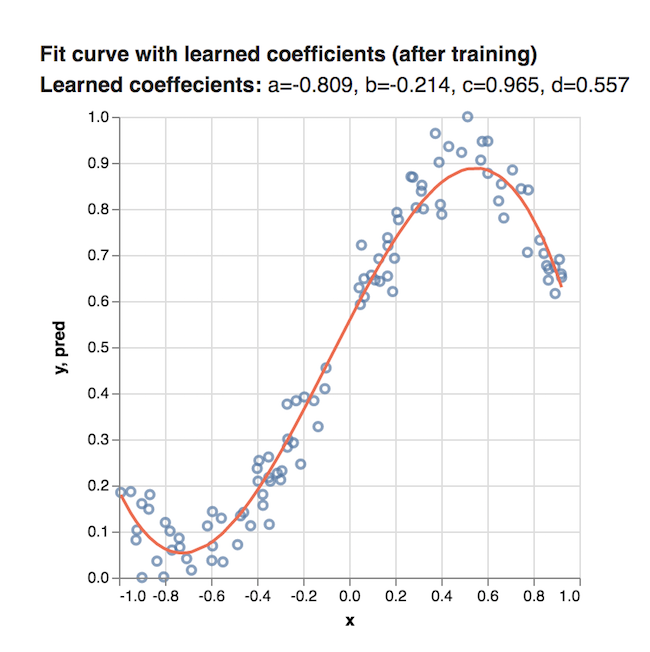

## 训练第一步：拟合曲线到合成数据

本教程演示了如何使用TensorFlow.js运算符重头构建小型玩具模型. 我们将使用多项式函数生成一些合成数据的曲线.

## 先决条件

本教程假设您熟悉TensorFlow.js的基本构建块介绍在[TensorFlow.js中的核心概念](./core-concepts.md):张量,变量和操作.我们建议在完成本教程之前完成核心概念。

## 运行代码

本教程重点介绍用于构建模型和其系数的TensorFlow.js代码.可以在[此处](https://github.com/tensorflow/tfjs-examples/tree/master/polynomial-regression-core)找到本教程的完整代码（包括数据生成和图表绘图代码）.

要在本地运行代码，需要安装以下依赖项:

Node.js version 8.9 or higher
Yarn or NPM CLI

这些说明使用Yarn，但是如果您熟悉NPM CLI并且更喜欢使用它，那么它仍然可以使用.

```
$ git clone https://github.com/tensorflow/tfjs-examples
$ cd tfjs-examples/polynomial-regression-core
$ yarn
$ yarn watch
```
上面的tfjs-examples/polynomial-regression-core目录是完全独立的，因此您可以复制它以启动您自己的项目.

## 输入数据

我们的合成数据集由x坐标和y坐标组成，在笛卡尔平面上绘制时如下所示:


该数据是使用三次函数
<em>y</em> = <em>a</em>x<sup>3</sup> + <em>b</em>x<sup>2</sup> + <em>c</em>x + <em>d</em>
的的格式生成.

我们的任务是学习这个函数的系数: 最适合数据的a，b，c和d的值.让我们看一下如何使用TensorFlow.js操作学习这些值.

## 步骤1: 设置变量

首先，让我们创建一些变量来保持我们在模型训练的每个步骤中对这些值的当前最佳估计. 首先，我们将为每个变量分配一个随机数:

```
const a = tf.variable(tf.scalar(Math.random()));
const b = tf.variable(tf.scalar(Math.random()));
const c = tf.variable(tf.scalar(Math.random()));
const d = tf.variable(tf.scalar(Math.random()));
```

## 步骤2: 构建一个模型

我们可以通过在TensorFlow.js中使用一系列的链式操作加法(add),乘法(mul)和幂(pow和square)来表示我们的多项式函数
<em>y</em> = <em>a</em>x<sup>3</sup> + <em>b</em>x<sup>2</sup> + <em>c</em>x + <em>d</em>.

以下代码构造一个预测函数，它将x作为输入并返回y:

```
function predict(x) {
  // y = a * x ^ 3 + b * x ^ 2 + c * x + d
  return tf.tidy(() => {
    return a.mul(x.pow(tf.scalar(3))) // a * x^3
      .add(b.mul(x.square())) // + b * x ^ 2
      .add(c.mul(x)) // + c * x
      .add(d); // + d
  });
}
```

让我们继续使用我们在步骤1中设置的a，b，c和d的随机值绘制我们的多项式函数。我们的图可能看起来像这样:


因为我们从随机值开始，所以我们的函数很可能不适合数据集.该模型尚未学习更好的系数值.

## 步骤 3: 训练模型

我们的最后一步是训练模型以学习系数的良好值.为了训练我们的模型，我们需要定义三件事:

* 损失函数,它测量给定多项式与数据的拟合程度.损失值越低,多项式拟合数据越好.

* 优化器, 它实现了一种算法，用于根据损失函数的输出修改我们的系数值. 优化器的目标是最小化损失函数的输出值.

* 训练循环，它将迭代运行优化器以最小化损失.

## 定义损失函数

对于本教程，我们将使用均方误差（MSE）作为我们的损失函数.通过对我们数据集中每个x值的实际y值和预测y值之间的差值求平方来计算MSE, 然后取所有结果的算术平均值.

我们可以在TensorFlow.js中定义MSE损失函数，如下所示:

```
function loss(predictions, labels) {
  // Subtract our labels (actual values) from predictions, square the results,
  // and take the mean.
  const meanSquareError = predictions.sub(labels).square().mean();
  return meanSquareError;
}
```

## 定义优化器

对于优化器, 我们将使用随机梯度下降（SGD）. SGD通过获取数据集中随机点的梯度并使用其值来通知是否增加或减少模型系数的值来工作.

TensorFlow.js提供了执行SGD的便利功能, 这样您就不必担心自己执行所有这些数学运算. tf.train.sgd 将所需的学习率作为输入, 并返回一个SGDOptimizer对象,可以调用它来优化损失函数的值.

学习率控制模型在改进预测时的调整量. 低学习率将使学习过程运行得更慢(学习好系数需要更多的训练迭代), 然较高的学习速度会加快学习速度，但可能导致模型围绕正确的值振荡, 总是过度矫正.

以下代码构造了一个学习率为0.5的SGD优化器:

```
const learningRate = 0.5;
const optimizer = tf.train.sgd(learningRate);
```

## 定义训练循环

现在我们已经定义了我们的损失函数和优化器, 我们可以建立一个训练循环, 迭代地执行SGD以优化我们的模型系数以最小化损失（MSE）. 我们的循环看起来像:

```
function train(xs, ys, numIterations = 75) {

  const learningRate = 0.5;
  const optimizer = tf.train.sgd(learningRate);

  for (let iter = 0; iter < numIterations; iter++) {
    optimizer.minimize(() => {
      const predsYs = predict(xs);
      return loss(predsYs, ys);
    });
  }
}
```

让我们仔细看看代码, 一步步。首先，我们定义训练函数，将数据集的x和y值以及指定的迭代次数作为输入:

```
function train(xs, ys, numIterations) {
...
}
```

接下来，我们定义学习速率和SGD优化器，如上一节所述：

```
const learningRate = 0.5;
const optimizer = tf.train.sgd(learningRate);
```

最后，我们设置了一个运行numIterations次训练迭代的for循环. 在每次迭代中，我们在优化器上调用minimize，这是魔术发生的地方:

```
for (let iter = 0; iter < numIterations; iter++) {
  optimizer.minimize(() => {
    const predsYs = predict(xs);
    return loss(predsYs, ys);
  });
}
```

minimize需要一个能完成两件事的函数:

 1. 它使用我们之前在步骤2中定义的预测模型函数预测所有x值的y值（predYs）.
 
 2. 它使用我们之前在定义损失函数中定义的损失函数返回那些预测的均方误差损失.

然后minimize自动调整此函数使用的任何变量（此处为系数a，b，c和d），以便最小化返回值（我们的损失）

在运行我们的训练循环之后，a，b，c和d将包含在75次SGD迭代之后由模型学习的系数值.

## 查看结果!

一旦程序完成运行, 我们可以得到变量a，b，c和d的最终值，并用它们绘制曲线:



结果比我们最初使用系数的随机值绘制的曲线好得多.

## 其他资源

 * 有关TensorFlow.js中核心构建块的介绍，请参阅TensorFlow.js的核心概念：张量，变量和操作.

 * 请参阅Machine Learning Crash Course中的Descending into ML有关机器学习损失的更深入介绍.
 
 * 请参阅Machine Learning Crash Course中的Reducing Loss深入了解梯度下降和SGD.

