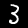

## 图像训练: 用卷积神经网络识别手写数字

在本教程中，我们将构建一个TensorFlow.js模型，用卷积神经网络对手写数字进行分类. 首先，我们将通过“查看”成千上万的手写数字图像及其标签来训练分类器. 然后我们将使用模型从未见过的测试数据来评估分类器的准确性.

## 先决条件

本教程假设您熟悉TensorFlow.js的基础构建模块 (张量,变量,和操作),以及优化器和损失的概念. 有关这些主题的更多背景信息, 我们建议在本教程之前完成以下教程:

* [TensorFlow.js中的核心概念](./core-concepts.md)
* [训练第一步：拟合曲线到合成数据](./fit-curve.md)

## 运行代码

可以在 
[TensorFlow.js examples](https://github.com/tensorflow/tfjs-examples/tree/master/mnist) 
仓库的 [tfjs-examples/mnist](https://github.com/tensorflow/tfjs-examples/tree/master/mnist) 
目录中找到本教程的完整代码.

要在本地运行代码，您需要安装以下依赖项:

* Node.js version 8.9 or higher

* Yarn or NPM CLI

这些说明使用Yarn，但是如果您熟悉NPM CLI并且更喜欢使用它，那么它仍然可以使用。

您可以通过克隆仓库并构建演示来运行示例代码:

```
$ git clone https://github.com/tensorflow/tfjs-examples
$ cd tfjs-examples/mnist
$ yarn
$ yarn watch
```
上面的tfjs-examples/mnist 目录是完全独立的，因此您可以复制它以启动您自己的项目。

**注**: 本教程的代码和 tfjs-examples/mnist-core 中的示例之间的区别是，在这里我们使用 TensorFlow.js 的高级API（Model，Layer）来构建模型，而 mnist-core 采用底层的线性代数操作来建立一个神经网络。

## 数据

我们将在本教程中使用[MNIST手写数据集](http://yann.lecun.com/exdb/mnist/)。我们将学习分类的手写MNIST数字如下所示：




为了预处理我们的数据，我们编写了data.js，其中包含MnistData类，它从我们提供的MNIST数据集的托管版本中获取随机批次的MNIST图像。

MnistData将整个数据集拆分为训练数据和测试数据. 当我们训练模型时, 分类器只能看到训练集. 当我们评估模型时，我们将仅使用模型尚未见到的测试集中的数据， 看模型的预测如何推广到全新的数据.

MnistData有两个公有方法：

* nextTrainBatch(batchSize)：从训练集中随机返回一批图像及其标签
* nextTestBatch(batchSize)：从测试集中返回一批图像及其标签

**注**: 在训练MNIST分类器时, 打乱数据是非常重要的, 这样可以避免模型的预测受到图像的顺序的影响. 例如，如果我们首先为模型提供所有数字1，在此阶段的训练期间，模型可能会学会简单地预测1 (since this minimizes the loss). If we were to then feed the model only 2s, it might simply switch to predicting only 2 and never predict a 1 (since, again, this would minimize loss for the new set of images). The model would never learn to make an accurate prediction over a representative sample of digits.

Building the Model
In this section, we'll build a convolutional image classifier model. To do so, we'll use a Sequential model (the simplest type of model), in which tensors are consecutively passed from one layer to the next.

First, let's instantiate our Sequential model with tf.sequential:

const model = tf.sequential();
Now that we've created a model, let's add layers to it.

Adding the First Layer
The first layer we’ll add is a two-dimensional convolutional layer. Convolutions slide a filter window over an image to learn transformations that are spatially invariant (that is, patterns or objects in different parts of the image will be treated the same way). For more information about convolutions, see this article.

We can create our 2-D convolutional layer using tf.layers.conv2d, which accepts a configuration object that defines the layer's structure:

model.add(tf.layers.conv2d({
  inputShape: [28, 28, 1],
  kernelSize: 5,
  filters: 8,
  strides: 1,
  activation: 'relu',
  kernelInitializer: 'VarianceScaling'
}));
Let’s break down each argument in the configuration object:

inputShape. The shape of the data that will flow into the first layer of the model. In this case, our MNIST examples are 28x28-pixel black-and-white images. The canonical format for image data is [row, column, depth], so here we want to configure a shape of [28, 28, 1]—28 rows and columns for the number of pixels in each dimension, and a depth of 1 because our images have only 1 color channel:

kernelSize. The size of the sliding convolutional filter windows to be applied to the input data. Here, we set a kernelSize of 5, which specifies a square, 5x5 convolutional window.

filters. The number of filter windows of size kernelSize to apply to the input data. Here, we will apply 8 filters to the data.

strides. The "step size" of the sliding window—i.e., how many pixels the filter will shift each time it moves over the image. Here, we specify strides of 1, which means that the filter will slide over the image in steps of 1 pixel.

activation. The activation function to apply to the data after the convolution is complete. In this case, we are applying a Rectified Linear Unit (ReLU) function, which is a very common activation function in ML models.

kernelInitializer. The method to use for randomly initializing the model weights, which is very important to training dynamics. We won’t go into the details of initialization here, but VarianceScaling (used here) is generally a good initializer choice.

Adding the Second Layer
Let’s add a second layer to the model: a max pooling layer, which we'll create using tf.layers.maxPooling2d. This layer will downsample the result (also known as the activation) from the convolution by computing the maximum value for each sliding window:

model.add(tf.layers.maxPooling2d({
  poolSize: [2, 2],
  strides: [2, 2]
}));
Let’s break down the arguments:

poolSize. The size of the sliding pooling windows to be applied to the input data. Here, we set a poolSize of [2,2], which means that the pooling layer will apply 2x2 windows to the input data.

strides. The "step size" of the sliding pooling window—i.e., how many pixels the window will shift each time it moves over the input data. Here, we specify strides of [2, 2], which means that the filter will slide over the image in steps of 2 pixels in both horizontal and vertical directions.

NOTE: Since both poolSize and strides are 2x2, the pooling windows will be completely non-overlapping. This means the pooling layer will cut the size of the activation from the previous layer in half.

Adding the Remaining Layers
Repeating layer structure is a common pattern in neural networks. Let's add a second convolutional layer, followed by another pooling layer to our model. Note that in our second convolutional layer, we're doubling the number of filters from 8 to 16. Also note that we don't specify an inputShape, as it can be inferred from the shape of the output from the previous layer:

model.add(tf.layers.conv2d({
  kernelSize: 5,
  filters: 16,
  strides: 1,
  activation: 'relu',
  kernelInitializer: 'VarianceScaling'
}));

model.add(tf.layers.maxPooling2d({
  poolSize: [2, 2],
  strides: [2, 2]
}));
Next, let's add a flatten layer to flatten the output of the previous layer to a vector:

model.add(tf.layers.flatten());
Lastly, let's add a dense layer (also known as a fully connected layer), which will perform the final classification. Flattening the output of a convolution+pooling layer pair before a dense layer is another common pattern in neural networks:

model.add(tf.layers.dense({
  units: 10,
  kernelInitializer: 'VarianceScaling',
  activation: 'softmax'
}));
Let’s break down the arguments passed to the dense layer.

units. The size of the output activation. Since this is the final layer, and we’re doing a 10-class classification task (digits 0–9), we use 10 units here. (Sometimes units are referred to as the number of neurons, but we’ll avoid that terminology.)

kernelInitializer. We'll use the same VarianceScaling initialization strategy for the dense layer that we used for the convolutional layers.

activation. The activation function of the last layer for a classification task is usually softmax. Softmax normalizes our 10-dimensional output vector into a probability distribution, so that we have a probability for each of the 10 classes.

Training the Model
To actually drive training of the model, we'll need to construct an optimizer and define a loss function. We'll also define an evaluation metric to measure how well our model performs on the data.

NOTE: For a deeper dive into optimizers and loss functions in TensorFlow.js, see the tutorial Training First Steps.

Defining the Optimizer
For our convolutional neural network model, we'll use a stochastic gradient descent (SGD) optimizer with a learning rate of 0.15:

const LEARNING_RATE = 0.15;
const optimizer = tf.train.sgd(LEARNING_RATE);
Defining Loss
For our loss function, we'll use cross-entropy (categoricalCrossentropy), which is commonly used to optimize classification tasks. categoricalCrossentropy measures the error between the probability distribution generated by the last layer of our model and the probability distribution given by our label, which will be a distribution with 1 (100%) in the correct class label. For example, given the following label and prediction values for an example of the digit 7:

class	0	1	2	3	4	5	6	7	8	9
label	0	0	0	0	0	0	0	1	0	0
prediction	.1	.01	.01	.01	.20	.01	.01	.60	.03	.02
categoricalCrossentropy gives a lower loss value if the prediction is a high probability that the digit is 7, and a higher loss value if the prediction is a low probability of 7. During training, the model will update its internal parameters to minimize categoricalCrossentropy over the whole dataset.

Defining the Evaluation Metric
For our evaluation metric, we'll use accuracy, which measures the percentage of correct predictions out of all predictions.

Compiling the Model
To compile the model, we pass it a configuration object with our optimizer, loss function, and a list of evaluation metrics (here, just 'accuracy'):

model.compile({
  optimizer: optimizer,
  loss: 'categoricalCrossentropy',
  metrics: ['accuracy'],
});
Configuring Batch Size
Before we begin training, we need to define a few more parameters related to batch size:

// How many examples the model should "see" before making a parameter update.
const BATCH_SIZE = 64;
// How many batches to train the model for.
const TRAIN_BATCHES = 100;

// Every TEST_ITERATION_FREQUENCY batches, test accuracy over TEST_BATCH_SIZE examples.
// Ideally, we'd compute accuracy over the whole test set, but for performance
// reasons we'll use a subset.
const TEST_BATCH_SIZE = 1000;
const TEST_ITERATION_FREQUENCY = 5;
More About Batching and Batch Size
To take full advantage of the GPU's ability to parallelize computation, we want to batch multiple inputs together and feed them through the network using a single feed-forward call.

Another reason we batch our computation is that during optimization, we update internal parameters (taking a step) only after averaging gradients from several examples. This helps us avoid taking a step in the wrong direction because of an outlier example (e.g., a mislabeled digit).

When batching input data, we introduce a tensor of rank D+1, where D is the dimensionality of a single input.

As discussed earlier, the dimensionality of a single image in our MNIST data set is [28, 28, 1]. When we set a BATCH_SIZE of 64, we're batching 64 images at a time, which means the actual shape of our data is [64, 28, 28, 1] (the batch is always the outermost dimension).

NOTE:* Recall that the inputShape in the config of our first conv2d did not specify the batch size (64). Configs are written to be batch-size-agnostic, so that they are able to accept batches of arbitrary size.

Coding the Training Loop
Here is the code for the training loop:

for (let i = 0; i < TRAIN_BATCHES; i++) {
  const batch = data.nextTrainBatch(BATCH_SIZE);
 
  let testBatch;
  let validationData;
  // Every few batches test the accuracy of the mode.
  if (i % TEST_ITERATION_FREQUENCY === 0) {
    testBatch = data.nextTestBatch(TEST_BATCH_SIZE);
    validationData = [
      testBatch.xs.reshape([TEST_BATCH_SIZE, 28, 28, 1]), testBatch.labels
    ];
  }
 
  // The entire dataset doesn't fit into memory so we call fit repeatedly
  // with batches.
  const history = await model.fit(
      batch.xs.reshape([BATCH_SIZE, 28, 28, 1]),
      batch.labels,
      {
        batchSize: BATCH_SIZE,
        validationData,
        epochs: 1
      });

  const loss = history.history.loss[0];
  const accuracy = history.history.acc[0];

  // ... plotting code ...
}
Let's break the code down. First, we fetch a batch of training examples. Recall from above that we batch examples to take advantage of GPU parallelization and to average evidence from many examples before making a parameter update:

const batch = data.nextTrainBatch(BATCH_SIZE);
Every 5 steps (our TEST_ITERATION_FREQUENCY, we construct validationData, an array of two elements containing a batch of MNIST images from the test set and their corresponding labels. We'll use this data to evaluate the accuracy of the model:

if (i % TEST_ITERATION_FREQUENCY === 0) {
  testBatch = data.nextTestBatch(TEST_BATCH_SIZE);
  validationData = [
    testBatch.xs.reshape([TEST_BATCH_SIZE, 28, 28, 1]),
    testBatch.labels
  ];
}
model.fit is where the model is trained and parameters actually get updated.

NOTE: Calling model.fit() once on the whole dataset will result in uploading the whole dataset to the GPU, which could freeze the application. To avoid uploading too much data to the GPU, we recommend calling model.fit() inside a for loop, passing a single batch of data at a time, as shown below:

// The entire dataset doesn't fit into memory so we call fit repeatedly
// with batches.
  const history = await model.fit(
      batch.xs.reshape([BATCH_SIZE, 28, 28, 1]), batch.labels,
      {batchSize: BATCH_SIZE, validationData: validationData, epochs: 1});
Let's break down the arguments again:

x. Our input image data. Remember that we are feeding examples in batches so we must tell the fit function how large our batch is. MnistData.nextTrainBatch returns images with shape [BATCH_SIZE, 784]—all the data for the image in a 1-D vector of length 784 (28 * 28). However, our model expects image data in the shape [BATCH_SIZE, 28, 28, 1], so we reshape accordingly.

y. Our labels; the correct digit classifications for each image.

batchSize. How many images to include in each training batch. Earlier we set a BATCH_SIZE of 64 to use here.

validationData. The validation set we construct every TEST_ITERATION_FREQUENCY (here, 5) batches. This data is in the shape [TEST_BATCH_SIZE, 28, 28, 1]. Earlier, we set a TEST_BATCH_SIZE of 1000. Our evaluation metric (accuracy) will be computed over this data set.

epochs. Number of training runs to perform on a batch. Since we are iteratively feeding batches to fit, we only want it to train from this batch a single time.

Each time we call fit, it returns a rich object that contains logs of our metrics, which we store in history. We extract our loss and accuracy for each training iteration, so we can plot them on a graph:

const loss = history.history.loss[0];
const accuracy = history.history.acc[0];
See the Results!
If you run the full code, you should see output like this:

Two plots. The first plot shows loss vs. training batch, with loss trending downward from batch 0 to batch 100. The second plot shows accuracy vs. test batch, with accuracy trending upward from batch 0 to batch 100
It looks like the model is predicting the right digit for most of the images. Great work!

Additional Resources
For more on convolution, see Understanding Convolutions by Chris Olah.

For more on loss, see Descending into ML in Machine Learning Crash Course for a more in-depth introduction to machine learning loss.

For more on gradient descent and SGD, see Reducing Loss in Machine Learning Crash Course.
