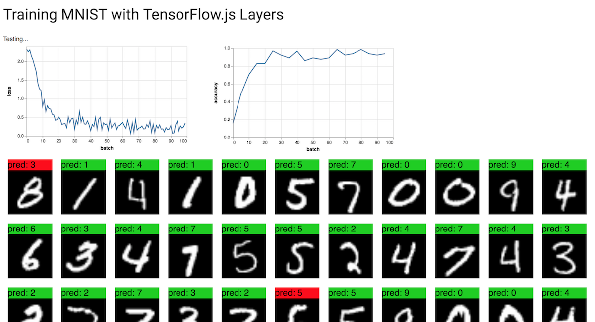

## 图像训练: 用卷积神经网络识别手写数字

在本教程中，我们将构建一个TensorFlow.js模型，用卷积神经网络对手写数字进行分类. 首先，我们将通过“查看”成千上万的手写数字图像及其标签来训练分类器. 然后我们将使用模型从未见过的测试数据来评估分类器的准确性.

## 先决条件

本教程假设您熟悉TensorFlow.js的基础构建模块 (张量,变量,和操作),以及优化器和损失的概念. 有关这些主题的更多背景信息, 我们建议在本教程之前完成以下教程:

* [TensorFlow.js中的核心概念](./core-concepts.md)
* [训练第一步：拟合曲线到合成数据](./fit-curve.md)

## 运行代码

可以在 
[TensorFlow.js examples](https://github.com/tensorflow/tfjs-examples/tree/master/mnist) 
仓库的 [tfjs-examples/mnist](https://github.com/tensorflow/tfjs-examples/tree/master/mnist) 
目录中找到本教程的完整代码.

要在本地运行代码，您需要安装以下依赖项:

* Node.js version 8.9 or higher

* Yarn or NPM CLI

这些说明使用Yarn，但是如果您熟悉NPM CLI并且更喜欢使用它，那么它仍然可以使用。

您可以通过克隆仓库并构建演示来运行示例代码:

```
$ git clone https://github.com/tensorflow/tfjs-examples
$ cd tfjs-examples/mnist
$ yarn
$ yarn watch
```
上面的tfjs-examples/mnist 目录是完全独立的，因此您可以复制它以启动您自己的项目。

**注**: 本教程的代码和 tfjs-examples/mnist-core 中的示例之间的区别是，在这里我们使用 TensorFlow.js 的高级API（Model，Layer）来构建模型，而 mnist-core 采用底层的线性代数操作来建立一个神经网络。

## 数据

我们将在本教程中使用[MNIST手写数据集](http://yann.lecun.com/exdb/mnist/)。我们将学习分类的手写MNIST数字如下所示：


为了预处理我们的数据，我们编写了data.js，其中包含MnistData类，它从我们提供的MNIST数据集的托管版本中获取随机批次的MNIST图像。

MnistData将整个数据集拆分为训练数据和测试数据. 当我们训练模型时, 分类器只能看到训练集. 当我们评估模型时，我们将仅使用模型尚未见到的测试集中的数据， 看模型的预测如何推广到全新的数据.

MnistData有两个公有方法：

* nextTrainBatch(batchSize)：从训练集中随机返回一批图像及其标签
* nextTestBatch(batchSize)：从测试集中返回一批图像及其标签

**注**: 在训练MNIST分类器时, 打乱数据是非常重要的, 这样可以避免模型的预测受到图像的顺序的影响. 例如，如果我们首先为模型提供所有数字1，在此阶段的训练期间，模型可能会学会简单地预测1 (因为这可以减少损失). 而如果我们每次训练时都提供的是2, 那么它也会简单切换为预测2并且永远不会预测1 (同样的，也是因为这样可以减少损失函数). 如果每次都提供这样典型的、有代表性的数字，那么这个模型将永远也学不会做出一个精确的预测.

## 构建模型

在本节中，我们将构建一个卷积图像分类器模型. 为此，我们将使用Sequential模型 (模型中最为简单的一个类型), 其中张量从一层连续传递到下一层.

首先，让我们用tf.sequential实例化我们的Sequential模型:

```
const model = tf.sequential();
Now that we've created a model, let's add layers to it.
```

## 添加第一层

我们要添加的第一层是二维卷积层. 卷积在图像上滑动过滤窗口以学习空间不变的变换 (也就是说，图像不同部分的图案或对象将以相同的方式处理). 有关卷积的更多信息, 请看[这篇文章](http://colah.github.io/posts/2014-07-Understanding-Convolutions/).

我们可以使用tf.layers.conv2d创建我们的2-D卷积层，它接受一个定义图层结构的配置对象:

```
model.add(tf.layers.conv2d({
  inputShape: [28, 28, 1],
  kernelSize: 5,
  filters: 8,
  strides: 1,
  activation: 'relu',
  kernelInitializer: 'VarianceScaling'
}));
```

让我们分析配置对象中的每个参数:

inputShape.将流入模型第一层的数据形状.在这种情况下,我们的MNIST示例是28x28像素的黑白图像. 所以我们在这里配置的形状是[28,28,1]——每个维度有28rowX28column个像素，而depth为1是因为我们的图像只有1个颜色通道:

kernelSize. 应用于输入数据的滑动卷积滤波器窗口的大小。在这里，我们设置kernelSize为5，它表示一个5x5的正方形卷积窗口.

filters. 要应用于输入数据的大小为kernelSize的过滤器窗口数。在这里，我们将对数据应用8个过滤器.

strides. 滑动窗口的“步长” - 即每次在图像上移动时，滤波器将移动多少个像素。在这里，我们指定步幅为1，这意味着过滤器将以1像素为单位滑过图像.

activation. 卷积完成后应用于数据的 激活函数。这里，我们使用了 Rectified Linear Unit (ReLU)函数，这是ML模型中非常常见的激活函数.

kernelInitializer. 用于随机初始化模型权重的方法，这对训练动力学非常重要。我们不会在这里讨论初始化的细节，但是VarianceScaling（这里使用）通常是一个很好的初始化器选择.

## 添加第二层
让我们在模型中添加第二层: 最大池化层, 我们将使用 tf.layers.maxPooling2d创建它。该层将通过计算每个滑动窗口的最大值来缩减卷积结果（即激活）的大小:

model.add(tf.layers.maxPooling2d({
  poolSize: [2, 2],
  strides: [2, 2]
}));

我们来分析一下这些参数:

poolSize. 要应用于输入数据的滑动池窗口的大小。在这里，我们设置poolSize为[2,2]，这意味着池化层将2x2窗口应用于输入数据.

strides. 滑动池窗口的“步长” - 即，每次窗口在输入数据上移动时窗口将移动多少像素。
在这里，我们指定[2,2]的步幅，这意味着滤镜将在水平和垂直方向上以2像素的步长在图像上滑动.

**注**: 由于poolSize和strides都是2×2，所以池窗口将完全不重叠。这意味着池化层会将前一层的激活图的大小减半.

## 添加剩余层

重复层结构是神经网络中的常见模式. 让我们添加第二个卷积层, 然后是我们模型的另一个池化层. 请注意，在我们的第二个卷积层中,我们将过滤器的数量从8增加到16.还要注意，我们没有指定inputShape,因为它可以从前一层的输出形状推断出来:

```
model.add(tf.layers.conv2d({
  kernelSize: 5,
  filters: 16,
  strides: 1,
  activation: 'relu',
  kernelInitializer: 'VarianceScaling'
}));

model.add(tf.layers.maxPooling2d({
  poolSize: [2, 2],
  strides: [2, 2]
}));
```
接下来，我们添加一个 flatten层，将前一层的输出平铺到一个向量中:

```
model.add(tf.layers.flatten());
```

最后，让我们添加一个 dense层（也称为全连接层），它将执行最终的分类。 在dense层前先对卷积+池化层的输出执行flatten也是神经网络中的另一种常见模式:

```
model.add(tf.layers.dense({
  units: 10,
  kernelInitializer: 'VarianceScaling',
  activation: 'softmax'
}));
```
我们来分析传递给dense层的参数.

units. 输出激活的大小。由于这是最后一层，我们正在进行10级分类任务（数字0-9），我们在这里使用10个单位。（有时单位被称为神经元的数量，但我们将避免使用该术语。）

kernelInitializer. 我们将对用于卷积层的密集层使用相同的VarianceScaling初始化策略。

activation.分类任务的最后一层的激活功能通常是softmax. Softmax将我们的10维输出向量归一化为概率分布，因此我们有10个类别中每个类别的概率.

## 训练模型

为了实际驱动模型的训练，我们需要构造一个优化器并定义一个损失函数.我们还将定义评估指标，以衡量我们的模型对数据的执行情况.

**注**: 要深入了解TensorFlow.js中的优化器和损失函数，请参阅教程的[训练第一步](./tutorials/fit-curve.md)

## 定义优化器

对于我们的卷积神经网络模型，我们将使用学习率为0.15的随机梯度下降（SGD）优化器:

```
const LEARNING_RATE = 0.15;
const optimizer = tf.train.sgd(LEARNING_RATE);
```
## 定义损失

对于我们的损失函数，我们将使用交叉熵（categoricalCrossentropy），它通常用于优化分类任务。categoricalCrossentropy测量模型的最后一层生成的概率分布与我们的标签给出的概率分布之间的误差，该分布将是正确类标签中的1（100％）分布。例如，给定数字7的示例的以下标签和预测值:

|class     |   0   |   1   |   2   |   3   |   4   |   5   |   6   |   7   |   8   |   9   |  
|----------|------:|------:|------:|------:|------:|------:|------:|------:|------:|------:|
|label     |   0   |   0   |   0   |   0   |   0   |   0   |   0   |   1   |   0   |   0   |  
|prediction|   .1  |   .01 |   .01 |   .01 |   .02 |   .01 |   .01 |   .06 |   .03 |   .02 |  

如果预测的结果是数字7的概率很高，那么categoricalCrossentropy会给出一个较低的损失值，而如果7的概率很低，那么categoricalCrossentropy的损失就会更高。在训练过程中，模型会更新它的内部参数以最小化在整个数据集上的categoricalCrossentropy.

## 定义评估指标

对于我们的评估指标，我们将使用准确度，该准确度衡量所有预测中正确预测的百分比.

## 编译模型

编译模型, 为了编译模型，我们传入一个由优化器，损失函数和一系列评估指标（这里只是'精度'）组成的配置对象:

```
model.compile({
  optimizer: optimizer,
  loss: 'categoricalCrossentropy',
  metrics: ['accuracy'],
});
```

## 配置批量大小

在我们开始培训之前，我们需要定义一些与批量大小相关的参数:

```
// How many examples the model should "see" before making a parameter update.
const BATCH_SIZE = 64;
// How many batches to train the model for.
const TRAIN_BATCHES = 100;

// Every TEST_ITERATION_FREQUENCY batches, test accuracy over TEST_BATCH_SIZE examples.
// Ideally, we'd compute accuracy over the whole test set, but for performance
// reasons we'll use a subset.
const TEST_BATCH_SIZE = 1000;
const TEST_ITERATION_FREQUENCY = 5;
```

**有关批处理和批处理大小的更多信息**

为了充分利用GPU并行计算的能力，我们希望将多个输入一起批处理，并使用单个前馈调用通过网络提供它们.

我们对计算进行批处理的另一个原因是，在优化期间，我们仅在对几个示例的梯度进行平均后才更新内部参数（采取步骤）。这有助于我们避免因错误的方向向前迈出一步（例如，错误标记的数字）.

当批量输入数据时，我们引入秩D + 1的张量，其中D是单个输入的维数.

如前所述，我们的MNIST数据集中单个图像的维度为[28,28,1]。当我们将BATCH_SIZE设置为64时，我们一次批量处理64个图像，这意味着我们数据的实际形状为[64,28,28,1]（批次始终是最外层维度）.

**注**:* 回想一下，我们第一个conv2d配置中的inputShape没有指定批量大小（64）。配置编写为批量大小不可知，因此它们能够接受任意大小的批量.

## 编码训练循环

以下是训练循环的代码:

```
for (let i = 0; i < TRAIN_BATCHES; i++) {
  const batch = data.nextTrainBatch(BATCH_SIZE);
 
  let testBatch;
  let validationData;
  // Every few batches test the accuracy of the mode.
  if (i % TEST_ITERATION_FREQUENCY === 0) {
    testBatch = data.nextTestBatch(TEST_BATCH_SIZE);
    validationData = [
      testBatch.xs.reshape([TEST_BATCH_SIZE, 28, 28, 1]), testBatch.labels
    ];
  }
 
  // The entire dataset doesn't fit into memory so we call fit repeatedly
  // with batches.
  const history = await model.fit(
      batch.xs.reshape([BATCH_SIZE, 28, 28, 1]),
      batch.labels,
      {
        batchSize: BATCH_SIZE,
        validationData,
        epochs: 1
      });

  const loss = history.history.loss[0];
  const accuracy = history.history.acc[0];

  // ... plotting code ...
}
```

让我们分析代码。 首先，我们获取一批训练样本。 回想一下上面说的，我们利用GPU并行化批量处理样本，在对大量样本进行平均后才更新参数:

```
const batch = data.nextTrainBatch(BATCH_SIZE);
```

每5个step（TEST_ITERATION_FREQUENCY），我们构造一次validationData，这是一个包含一批来自MNIST测试集的图像及其相应标签这两个元素的数组，我们将使用这些数据来评估模型的准确性:

```
if (i % TEST_ITERATION_FREQUENCY === 0) {
  testBatch = data.nextTestBatch(TEST_BATCH_SIZE);
  validationData = [
    testBatch.xs.reshape([TEST_BATCH_SIZE, 28, 28, 1]),
    testBatch.labels
  ];
}
```
model.fit是模型训练和参数实际更新的地方.

**注**: 在整个数据集上执行一次model.fit会导致将整个数据集上传到GPU，这可能会使应用程序死机。 为避免向GPU上传太多数据，我们建议在for循环中调用model.fit()，一次传递一批数据，如下所示:

```
// The entire dataset doesn't fit into memory so we call fit repeatedly
// with batches.
  const history = await model.fit(
      batch.xs.reshape([BATCH_SIZE, 28, 28, 1]), batch.labels,
      {batchSize: BATCH_SIZE, validationData: validationData, epochs: 1});
```

我们再来分析一下这些参数:

x. 输入图像数据。请记住，我们分批量提供样本，因此我们必须告诉fit函数batch有多大。 MnistData.nextTrainBatch返回形状为[BATCH_SIZE，784]的图像 —— 所有的图像数据是长度为784（28 * 28）的一维向量。但是，我们的模型预期图像数据的形状为[BATCH_SIZE，28,28,1]，因此我们需要使用reshape函数.

y. 我们的标签;每个图像的正确数字分类.

batchSize. 每个训练batch中包含多少个图像。之前我们在这里设置的BATCH_SIZE是64.

validationData. 每隔TEST_ITERATION_FREQUENCY（这里是5）个Batch，我们构建的验证集。该数据的形状为[TEST_BATCH_SIZE，28,28,1]。之前，我们设置了1000的TEST_BATCH_SIZE。我们的评估度量（准确度）将在此数据集上计算.

epochs.批量执行的训练次数。由于我们分批把数据馈送到fit函数，所以我们希望它每次仅从这个batch上进行训练.

每次调用fit的时候，它会返回一个包含指标日志的对象，我们把它存储在history。我们提取每次训练迭代的损失和准确度，以便将它们绘制在图上:

```
const loss = history.history.loss[0];
const accuracy = history.history.acc[0];
```

## See the Results!

如果您运行完整代码，您应该看到这样的输出:
 

看起来模型正在预测大多数图像的正确数字。做得好！

## 其他资源

* 有关卷积的更多信息，请参阅Chris Olah的 [Understanding Convolutions](http://colah.github.io/posts/2014-07-Understanding-Convolutions/) 。

* 有关损失的更多信息，请参阅 [Machine Learning Crash Course](https://developers.google.com/machine-learning/crash-course/) 中的[Descending into ML](https://developers.google.com/machine-learning/crash-course/descending-into-ml/) ，以更深入地了解机器学习中的损失。

* 有关梯度下降和SGD的更多信息，请参阅 [Machine Learning Crash Course](https://developers.google.com/machine-learning/crash-course/)中的 [Reducing Loss](https://developers.google.com/machine-learning/crash-course/reducing-loss/)。
